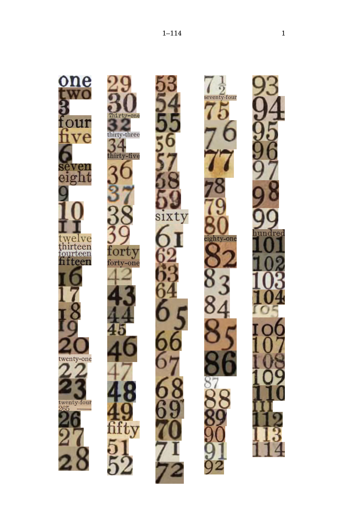
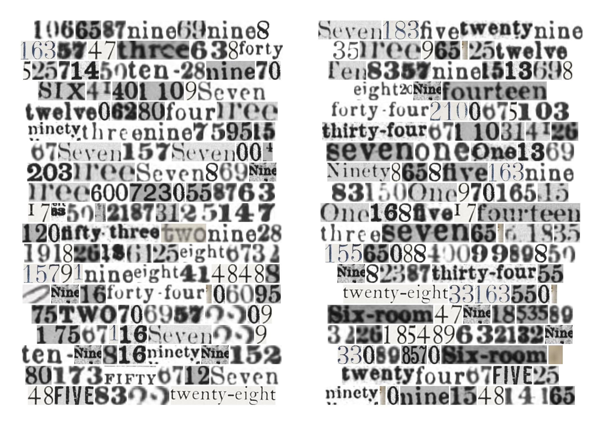
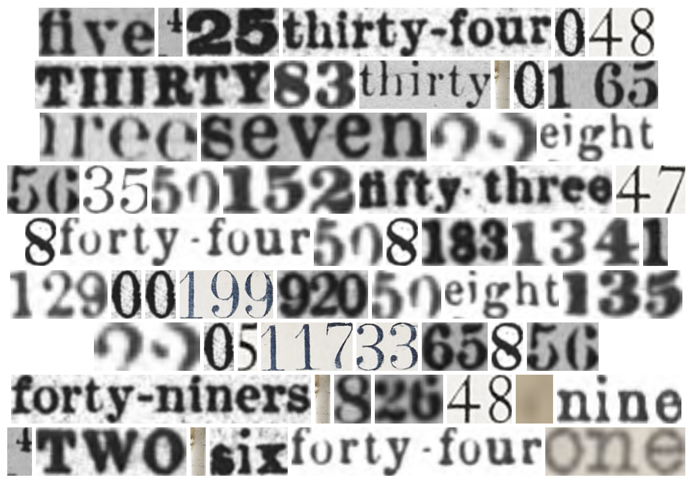

# pi with 50 thousand digits

Generate a PDF of a book containing the pi with fifty-thousand digits as automatically extracted from a corpus of scanned books.



Full [HTML output](https://hugovk.github.io/the-numbers-nanogenmo-2025/%CF%80.html) and [PDF output](https://hugovk.github.io/the-numbers-nanogenmo-2025/%CF%80.pdf) (9.9MB) for NaNoGenMo 2025.

## Steps

1. **Fetch copyright-free books from the Internet Archive**
   ```bash
   python fetch_from_ia.py <email> <collection> --limit <count>
   ```
   Downloads books with hOCR and page images from specified collection. You must supply an email address that will be bundled as part of the HTTP request to IA.

   Anywhere from 200 to 1,000 individual books should provide a good range of source material for 
   visually-interesting output.

2. **Extract number images**
   ```bash
   python extract_all_numbers.py
   ```
   For each page of each book, extract individual PNG files of digits and number words in the range from 0-50,000.

3. **Make pi**
   ```bash
   uv run make_pi.py
   ```
   Creates an HTML file.

4. **Build the book!**

   Open HTML in browser, print to PDF...


Most scripts have command-line arguments to fine-tune the output.

## Suggested Internet Archive collections

Best collections with hOCR data by item count (pre-1925, English, public domain):

- americana: 987,258
- toronto: 251,969
- cdl: 182,334
- internetarchivebooks: 158,978
- university_of_toronto: 156,370
- library_of_congress: 149,071
- bostonpubliclibrary: 36,520
- allen_county: 28,794
- gerstein: 22,114
- cornell: 21,352
- trent_university: 10,177


## More examples

Two pages:



Spreads:


Detail:


